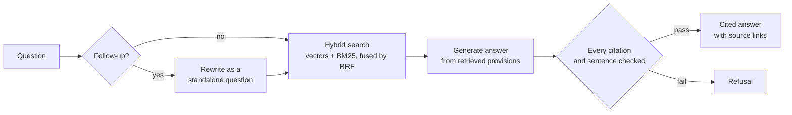

# EU AI Act Compliance Assistant

Ask a question about the EU AI Act and get a short answer in which every
sentence cites the provision it comes from — or a plain refusal when the Act
does not support an answer.

Built for compliance officers and product teams who need to know *where* the
law says something, not a fluent paraphrase of what it probably says.

## What makes it different

Most retrieval-augmented chatbots ask the model to cite its sources and trust
that it did. This one checks, in code, after the model answers:

- **Every citation must trace to a retrieved provision.** A cited article that
  was not in the retrieved context — a fabricated or misremembered one — turns
  the whole answer into a refusal. `Article 5(1)(a)` is accepted from a
  retrieved `Article 5(1)` only if point `(a)` actually appears in its text.
- **Every sentence must carry a citation.** One real citation cannot carry
  uncited prose along with it.
- **Off-topic questions are refused before any paid call.** If no retrieved
  provision is similar enough to the question, the app refuses for free.
- **Refusal is a first-class outcome.** Each refusal is logged with the check
  it failed (`no_hits`, `below_floor`, `unsupported_citation`, `no_citation`,
  `uncited_sentence`, `too_long`), so a model declining can be told apart from
  a caught fabrication.
- **Retrieved text and user input are treated as data.** Provisions reach the
  model only in the user message, and every line of visitor text is quoted, so
  a question cannot pose as a provision of the Act.

Citations in the UI link straight to the provision on EUR-Lex.

## How it works



1. **Corpus.** Regulation (EU) 2024/1689 from EUR-Lex: the consolidated text
   in force as of 2026-07-27 for articles and annexes, and the Official
   Journal version for recitals. Sources and their sha256 hashes are recorded
   in `data/raw/manifest.json`.
2. **Chunking on legal structure, never by character count.** 901 chunks: 675
   article paragraphs or points, 46 annex sections, 180 recitals. Each one
   carries its exact citation label (`Article 6(3)`, `Annex III, point 4`),
   title, chapter and source URL.
3. **Hybrid retrieval.** OpenAI `text-embedding-3-small` vectors in Chroma,
   plus BM25 for exact legal terms like "Annex III", merged by Reciprocal Rank
   Fusion.
4. **A three-step LangGraph pipeline**: rewrite (follow-ups only), retrieve,
   generate. It has no agent loop, so each turn costs a known, bounded number
   of model calls.

## Measured, not assumed

Retrieval is scored against 36 hand-labelled questions (`evals/questions.yaml`).
28 are phrased in the Act's own vocabulary and 8 as a layperson would ask.
The table shows the share of questions with a correct chunk in the top k:

| | recall@5 | recall@20 | MRR@5 |
|---|---|---|---|
| Vector search only | 0.86 | 0.92 | 0.678 |
| Hybrid (shipped) | 0.58 | 0.92 | 0.490 |

Adding BM25 lowered top-5 ranking on this corpus while leaving recall at depth
unchanged. The measurements, the alternatives tried, and the reasoning for the
current choice are in [DECISIONS.md](DECISIONS.md).

The follow-up rewrite has its own eval (`evals/followups.yaml`). It raises
recall@5 on follow-up questions from 0.55 as typed to 0.73, against a ceiling
of 1.00 for hand-written standalone questions.

## Run it

Requires Python 3.12+ and an OpenAI API key. The chunked corpus and the vector
index are committed, so nothing needs building first.

```bash
uv venv --python 3.12
source .venv/bin/activate
uv pip install -r requirements.txt
cp .env.example .env          # then set OPENAI_API_KEY

streamlit run app.py          # the chat UI
python scripts/ask.py         # the same assistant in the terminal
python scripts/query.py "..." # retrieval only, no model call: shows what the
                              # model would be given
```

All settings (models, `TOP_K`, spend caps, relevance floor, paths) are
environment variables, documented with their defaults in
[.env.example](.env.example).

### Tests and evals

```bash
pytest -q                           # 245 tests, offline, no API key needed
python evals/run_eval.py            # retrieval recall and MRR (live API)
python evals/run_eval.py --sweep    # the same at k = 1, 3, 5, 10, 20
python evals/run_eval.py --followups
```

The tests run against real EUR-Lex HTML fixtures with a fake embedder and
generator, so they never touch the network.

### Rebuilding the corpus

Only needed after a change to the source or the chunker:

```bash
python scripts/fetch_source.py   # download from EUR-Lex into data/raw/
python scripts/build_chunks.py   # data/raw/ -> data/chunks/chunks.jsonl
python scripts/build_index.py    # embed and index, about $0.003
```

## Deploying

- The app opens the committed index read-only. It copies the index to a
  scratch directory first, so it runs on hosts with a read-only filesystem.
  Set `SCRATCH_DIR` if the system temp directory is not writable.
- Every query is logged with the question, rewritten question, retrieved chunk
  ids, scores and outcome. Logs go to `data/logs/` (pruned after
  `LOG_RETENTION_DAYS`) and to stdout for the host's log viewer. Visitor
  addresses are stored only as a salted hash, and only when `LOG_SALT` is set.
- Spend is capped per session (`MAX_QUESTIONS`, default 10) and per client
  address (`MAX_QUESTIONS_PER_IP`, default 30). Set a usage limit on the
  OpenAI account as well; these caps bound one visitor, not the bill.

## Project layout

```
core/       config, chunker, embed, index, retrieve, generate, graph
app.py      Streamlit UI: rendering and spend caps only
scripts/    offline corpus pipeline and command-line tools
evals/      retrieval and rewrite evaluation sets and runner
tests/      offline test suite with real EUR-Lex fixtures
data/       committed chunks and index; raw HTML is fetched, not committed
```

## Limitations

- **The citation check confirms that a cited provision was retrieved, not that
  the sentence says what the provision says.** A sentence that attaches a real
  citation to invented prose passes. Catching that would need a second model
  call as a judge.
- **Neighbouring law gets past the free relevance filter.** GDPR or Digital
  Services Act questions look similar to AI Act text, so they reach the model,
  which then refuses. That refusal costs one call.
- **Lay phrasing retrieves worse than legal phrasing.** Questions that avoid
  the Act's vocabulary are the weakest group in the eval.
- English only, one regulation, no user accounts.

Not legal advice. Verify anything you act on against the Official Journal.
